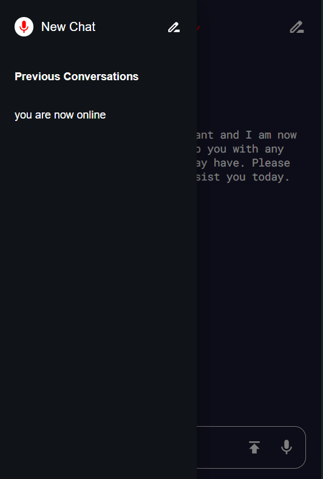

# Voice to Voice AI Chatbot

Made on React + Vite

## Technologies Used

- React Speech Recognition
- Google Gemini
- Browser Speech Synthesis

### Commands

 install packages - `npm i or npm install or yarn`
  
 start - `npm run dev or yarn dev`
  
 build - `npm run build or yarn build`
  

#### Environment Variables
`VITE_REACT_GEMINI_KEY= "YOUR_GEMINI_API_KEY"`

Hosted on - https://voice-to-voice-ai.vercel.app/

#### screenshots:

 

Please give a star if you like it :smiley: